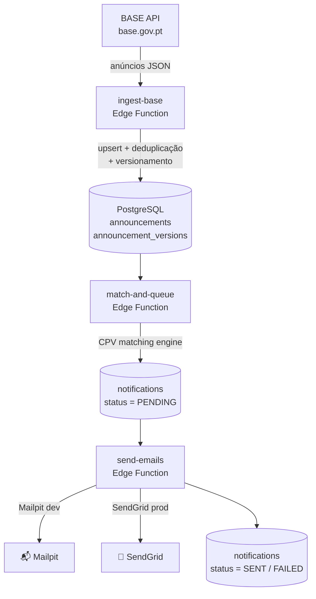

# BASE Monitor

> Sistema de monitorização de anúncios de contratação pública do portal [BASE](https://base.gov.pt).  
> Recebe contratos da API BASE, faz matching por códigos CPV e envia notificações por email aos subscritores.


---

## Índice

- [Arquitectura](#arquitectura)
- [Pré-requisitos](#pré-requisitos)
- [Início Rápido](#início-rápido)
- [Configuração detalhada](#configuração-detalhada)
- [Fluxo de dados](#fluxo-de-dados)
- [Edge Functions](#edge-functions)
- [Variáveis de ambiente](#variáveis-de-ambiente--referência-completa)
- [Deploy em produção](#deploy-em-produção)
- [Troubleshooting](#troubleshooting)

---

## Arquitectura

```
base-monitor/
├── apps/
│   └── web/                   # Frontend Next.js 14 (App Router + TypeScript + Tailwind)
│       └── src/
│           ├── app/
│           │   ├── (dashboard)/  # Páginas autenticadas: dashboard, definições, anúncios, …
│           │   ├── login/        # Página de autenticação
│           │   └── api/          # Route handlers
│           ├── components/       # Componentes React reutilizáveis
│           └── lib/              # Cliente Supabase, helpers
├── supabase/
│   ├── migrations/            # SQL de inicialização do schema (3 ficheiros)
│   ├── functions/             # Supabase Edge Functions (Deno)
│   │   ├── _shared/           # Utilitários partilhados (CPV matcher, email, …)
│   │   ├── admin-seed/        # Inicialização do tenant e utilizador admin
│   │   ├── ingest-base/       # Ingestão de anúncios da API BASE
│   │   ├── match-and-queue/   # Matching CPV → criação de notificações
│   │   └── send-emails/       # Envio de emails (Mailpit / SendGrid)
│   └── cron/                  # Agendador local (Node.js + tsx)
├── .env                       # Variáveis de ambiente (NÃO versionar)
├── .env.example               # Template de variáveis
└── cpvs_final.json            # Taxonomia CPV completa
```

---

## Pré-requisitos

| Ferramenta         | Versão mínima    | Instalação                                                               |
| ------------------ | ---------------- | ------------------------------------------------------------------------ |
| **Supabase CLI**   | última           | `scoop install supabase` ou [docs](https://supabase.com/docs/guides/cli) |
| **Docker Desktop** | —                | Necessário para Supabase local                                           |
| **Node.js**        | 20+              | [nodejs.org](https://nodejs.org)                                         |
| **npm**            | incluído no Node | —                                                                        |
| **Deno**           | (opcional)       | Para correr os testes das edge functions                                 |

---

## Início Rápido

```powershell
# 1. Copiar e preencher variáveis de ambiente
Copy-Item .env.example .env
notepad .env

# 2. Iniciar Supabase (Docker tem de estar a correr)
supabase start

# 3. Aplicar o schema da base de dados
supabase db reset

# 4. Copiar .env para as edge functions
Copy-Item .env supabase/functions/.env

# 5. Servir as edge functions (numa PowerShell separada)
supabase functions serve --env-file supabase/functions/.env

# 6. Instalar dependências e iniciar o frontend (numa PowerShell separada)
cd apps/web
npm install
npm run dev
```

Aceda a **http://localhost:3001**, registe-se e clique em **"Inicializar Sistema"** no Dashboard.

---

## Configuração detalhada

### 1. Variáveis de ambiente

Copie o template e preencha os valores:

```powershell
Copy-Item .env.example .env
notepad .env
```

Campos obrigatórios no `.env`:

```env
SUPABASE_URL=http://127.0.0.1:54321
SUPABASE_ANON_KEY=<Publishable key – ver saída de "supabase start">
SUPABASE_SERVICE_ROLE_KEY=<Secret key – ver saída de "supabase start">
BASE_API_URL=https://www.base.gov.pt/APIBase2
BASE_API_TOKEN=<o seu token BASE>
EMAIL_PROVIDER=mailpit
EMAIL_FROM=noreply@basemonitor.local
MAILPIT_URL=http://host.docker.internal:54324
APP_BASE_URL=http://localhost:3001
ADMIN_SEED_SECRET=<gere uma string aleatória, ex: openssl rand -hex 32>
```

Copiar também para as edge functions (precisam apenas de um subconjunto):

```powershell
Copy-Item .env supabase/functions/.env
```

---

### 2. Iniciar Supabase local

```powershell
supabase start
```

> Se já estiver a correr: `supabase status` mostra as chaves e URLs actuais.

---

### 3. Aplicar o schema (migrations)

```powershell
# Reset completo (apaga dados locais)
supabase db reset

# Aplicar sem apagar dados existentes
supabase db push
```

Confirme as tabelas no Supabase Studio em http://127.0.0.1:54323.

---

### 4. Iniciar as Edge Functions

```powershell
# Numa PowerShell separada
supabase functions serve --env-file supabase/functions/.env
```

As funções ficam disponíveis em:

| Função            | URL                                                 |
| ----------------- | --------------------------------------------------- |
| `admin-seed`      | http://127.0.0.1:54321/functions/v1/admin-seed      |
| `ingest-base`     | http://127.0.0.1:54321/functions/v1/ingest-base     |
| `match-and-queue` | http://127.0.0.1:54321/functions/v1/match-and-queue |
| `send-emails`     | http://127.0.0.1:54321/functions/v1/send-emails     |

---

### 5. Iniciar o frontend

```powershell
cd apps/web
npm install
npm run dev
```

Aceda a **http://localhost:3001**

---

### 6. Criar utilizador e inicializar o sistema

1. Abre http://localhost:3001/login
2. Clica em **"Criar conta"** e regista-te com email + password  
   _(Local: confirmação de email pode estar desactivada em `supabase/config.toml`)_
3. Faz login
4. No **Dashboard** ou em **Definições**, clica em **"Inicializar Sistema"**  
   → Chama `admin-seed` e cria o tenant "Default" com o utilizador como `admin`

---

### 7. Testar ingestão manual

**Via frontend (recomendado):** Dashboard → botão **"Ingerir Agora"**

**Via PowerShell:**

```powershell
# Obtém a service role key
$token = (supabase status --output json | ConvertFrom-Json).SERVICE_ROLE_KEY

# Ingestão de anúncios para um intervalo de datas
Invoke-RestMethod `
  -Uri "http://127.0.0.1:54321/functions/v1/ingest-base" `
  -Method POST `
  -Headers @{ "Authorization" = "Bearer $token"; "Content-Type" = "application/json" } `
  -Body '{"from_date":"2024-01-01","to_date":"2024-01-07"}'

# Dry run (não persiste dados)
Invoke-RestMethod `
  -Uri "http://127.0.0.1:54321/functions/v1/ingest-base" `
  -Method POST `
  -Headers @{ "Authorization" = "Bearer $token"; "Content-Type" = "application/json" } `
  -Body '{"dry_run":true}'

# Matching CPV → notificações
Invoke-RestMethod `
  -Uri "http://127.0.0.1:54321/functions/v1/match-and-queue" `
  -Method POST `
  -Headers @{ "Authorization" = "Bearer $token"; "Content-Type" = "application/json" } `
  -Body '{}'

# Envio de emails
Invoke-RestMethod `
  -Uri "http://127.0.0.1:54321/functions/v1/send-emails" `
  -Method POST `
  -Headers @{ "Authorization" = "Bearer $token"; "Content-Type" = "application/json" } `
  -Body '{}'
```

---

### 8. Configurar o cron local

```powershell
cd supabase/cron
npm install
```

| Modo                   | Comando                 |
| ---------------------- | ----------------------- |
| Execução única (teste) | `npx tsx run.ts --once` |
| Daemon contínuo        | `npx tsx run.ts`        |

**Agendador de Tarefas do Windows (execução automática)**

1. Abre **Agendador de Tarefas** (`taskschd.msc`)
2. **Acção → Criar Tarefa Básica**
3. Nome: `BASE Monitor Cron`
4. Gatilho: `Diariamente` → repetir a cada `2 horas`
5. Acção: `Iniciar um programa`
   - Programa: `node` (ou caminho completo `C:\Program Files\nodejs\node.exe`)
   - Argumentos: `--loader tsx/esm C:\dev\base-monitor\supabase\cron\run.ts --once`
   - Iniciar em: `C:\dev\base-monitor`
6. Para `send-emails`: criar tarefa separada com repetição a cada `10 minutos`

---

### 9. Ver emails no Mailpit

Aceda a **http://127.0.0.1:54324** para inspeccionar emails enviados em desenvolvimento.

---

### 10. Executar testes unitários

```powershell
# Requer Deno instalado
deno test supabase/functions/_shared/__tests__/cpvMatcher.test.ts
deno test supabase/functions/_shared/__tests__/canonicalJson.test.ts
```

---

## Fluxo de dados



---

## Edge Functions

| Função            | Trigger            | Frequência sugerida              |
| ----------------- | ------------------ | -------------------------------- |
| `admin-seed`      | Manual (frontend)  | Uma vez, aquando da configuração |
| `ingest-base`     | Cron + manual      | Cada 2 horas                     |
| `match-and-queue` | Após `ingest-base` | Cada 2 horas                     |
| `send-emails`     | Cron + manual      | Cada 10 minutos                  |

---

## Variáveis de ambiente – referência completa

| Variável                        | Onde usar                     | Descrição                         |
| ------------------------------- | ----------------------------- | --------------------------------- |
| `SUPABASE_URL`                  | `.env`, `functions/.env`      | URL base do Supabase              |
| `SUPABASE_ANON_KEY`             | `.env`, `apps/web/.env.local` | Chave anónima (publishable)       |
| `SUPABASE_SERVICE_ROLE_KEY`     | `.env`, cron                  | Chave de serviço (secret)         |
| `BASE_API_URL`                  | `functions/.env`              | URL da API BASE                   |
| `BASE_API_TOKEN`                | `functions/.env`              | Token de autenticação da API BASE |
| `EMAIL_PROVIDER`                | `functions/.env`              | `dev` / `mailpit` / `sendgrid`    |
| `EMAIL_FROM`                    | `functions/.env`              | Endereço remetente                |
| `MAILPIT_URL`                   | `functions/.env`              | URL do Mailpit (dentro do Docker) |
| `SENDGRID_API_KEY`              | `functions/.env`              | Chave SendGrid (produção)         |
| `APP_BASE_URL`                  | `functions/.env`              | URL pública do frontend           |
| `ADMIN_SEED_SECRET`             | `functions/.env`              | Secret para re-seed de admin      |
| `NEXT_PUBLIC_SUPABASE_URL`      | `apps/web/.env.local`         | URL Supabase (cliente browser)    |
| `NEXT_PUBLIC_SUPABASE_ANON_KEY` | `apps/web/.env.local`         | Chave anónima (cliente browser)   |

---

## Deploy em produção

### 1. Supabase Cloud

```powershell
# Autenticar e ligar ao projecto
supabase login
supabase link --project-ref <ref>

# Aplicar migrations
supabase db push

# Deploy das functions
supabase functions deploy admin-seed
supabase functions deploy ingest-base
supabase functions deploy match-and-queue
supabase functions deploy send-emails

# Definir secrets
supabase secrets set BASE_API_TOKEN=<token>
supabase secrets set EMAIL_PROVIDER=sendgrid
supabase secrets set SENDGRID_API_KEY=SG.<chave>
supabase secrets set EMAIL_FROM=noreply@dominio.pt
supabase secrets set APP_BASE_URL=https://basemonitor.dominio.pt
supabase secrets set ADMIN_SEED_SECRET=<secret>
```

### 2. Frontend em Vercel

```powershell
cd apps/web
npx vercel
```

Definir no dashboard Vercel:

```
NEXT_PUBLIC_SUPABASE_URL=https://<ref>.supabase.co
NEXT_PUBLIC_SUPABASE_ANON_KEY=<anon key>
```

### 3. Cron em produção

Opções (por ordem de preferência):

- **Supabase Cron** (`pg_cron`) — configurável no Dashboard do Supabase Cloud
- **GitHub Actions** — workflow com `schedule` (cron syntax)
- **VPS crontab** — usando o mesmo script Node

---

## Troubleshooting

### `"No tenant found"`

→ Execute `admin-seed` primeiro: botão **"Inicializar Sistema"** no Dashboard ou Definições.

### Edge functions não arrancam

```powershell
# Ver logs detalhados
supabase functions serve --env-file supabase/functions/.env --debug
```

### Emails não aparecem no Mailpit

- Verificar `EMAIL_PROVIDER=mailpit` em `supabase/functions/.env`
- Dentro do Docker, a URL deve ser `http://host.docker.internal:54324` (não `127.0.0.1`)
- Ver logs da function `send-emails`

### BASE API retorna erro 401

→ Verificar `BASE_API_TOKEN` em `supabase/functions/.env`.

### RLS bloqueia queries no frontend

→ As Edge Functions usam `SUPABASE_SERVICE_ROLE_KEY` (bypassa RLS).  
→ O frontend usa `SUPABASE_ANON_KEY` e requer autenticação activa.

### Frontend abre na porta errada

→ O servidor de desenvolvimento corre na porta **3001** (`npm run dev` em `apps/web`).  
→ Aceda a http://localhost:3001, não 3000.
